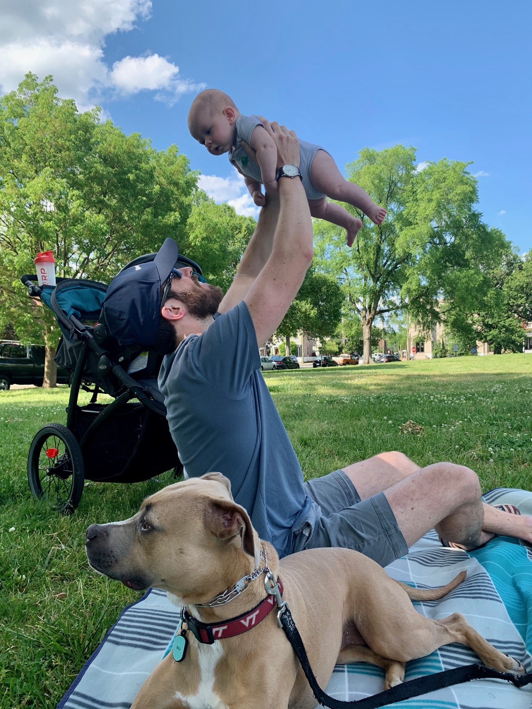

```{r setup, include=FALSE, echo = FALSE}
knitr::opts_chunk$set(echo = TRUE, fig.align = "center")
```

I am an educator, researcher, data scientist, and writer. I am currently an Education Data Specialist for Chesterfield County Public Schools, where I use data to help guide decisions and improve students' educational experiences. In my free time, I enjoy reading, writing, data visualization/analysis, going to the gym, and spending time with friends & family (including my pup, Nala).


{width=100%} 

{width=100%} 

<br/>

I earned my PhD in educational psychology from the [VCU School of Education](https://soe.vcu.edu/) in July 2019, where I worked in the [Motivation and Self-Regulation Lab](http://wp.vcu.edu/skzumbrunn/) and in the [Cognition and Learning Lab](https://rampages.us/coglearnlab/) to study students' motivation, behaviors, and achievement. In my [dissertation](https://scholarscompass.vcu.edu/etd/5977/), I studied how writers' daily emotional states (think: anxiety, enjoyment, boredom) influenced their productivity as well as the day-to-day inertia of these emotional states.

During grad school, I discovered a love for working with data -- exploring, visualizing, modeling, and communicating. I mostly work (and blog) in `R`, but I'm always learning new languages and technologies. Well, as much as I can with a toddler and an infant in the house.

## Projects and Publications

If you're interested in seeing some of the things I've worked on, check out my [publications page](https://www.ericekholm.com/pubs.html), my [visualizations page](https://www.ericekholm.com/viz.html), or my [blog](https://www.ericekholm.com/blog.html). You can also browse through my [Github](https://github.com/ekholme) for things I'm working on that maybe haven't made it to my website yet.

## Consulting and Contracted Work

Time permitting, I occasionally do some consulting and contract work. Although I specialize in educational research, I'm generally proficient with  a wide range of statistical modeling frameworks, data visualization, and dashboard design (via `{shiny}`), among other things. If you're interested in working with me, [send me an email](mailto:eric.ekholm@gmail.com).


